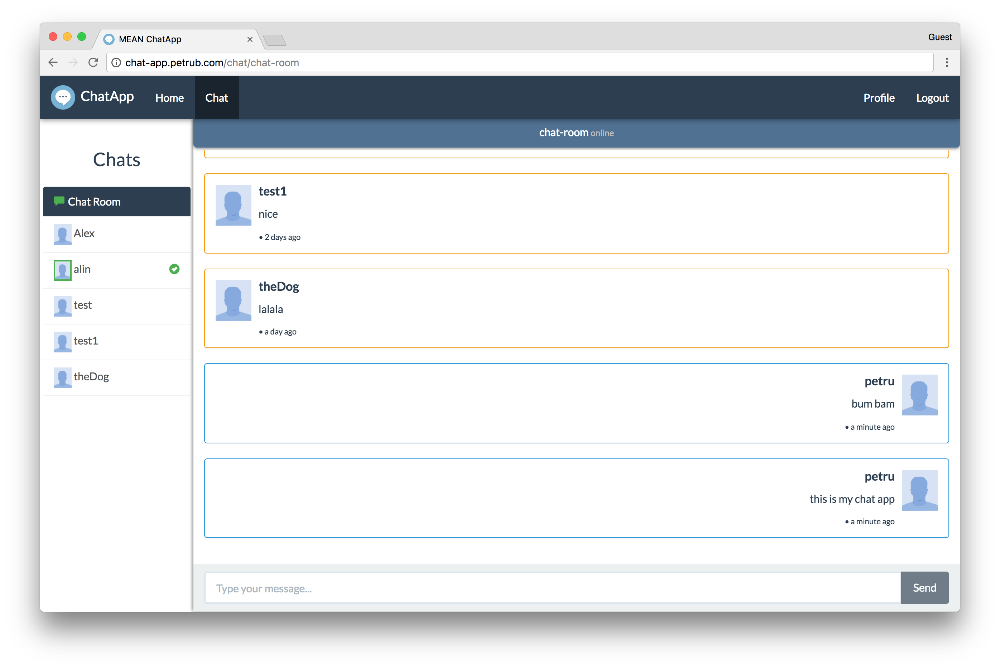

## Video Demo 
- https://youtu.be/y4RAoWgSzXQ


# Getting started

### Prerequisites

> if you don't know what you are doing go on the website and follow the instructions, those are pretty straight forward

- [NodeJS](https://nodejs.org)
- [MongoDB](https://www.mongodb.com/)
- [Angular-CLI](https://cli.angular.io/)

```bash
# clone the repo
git clone https://github.com/petr166/mean-chat-app.git

# [backend api]
# change into the repo directory
cd mean-chat-app

# install server dependencies
npm install

# !! create .env file with the model from .env.example !!
cp .env.example .env

# start the development server
npm run dev


# now open another terminal window
# [frontend angular app]
# change into the angular src directory
cd angular-src

# install frontend dependencies
npm install

# start angular development server
npm start
```

Then visit http://localhost:4200 in your browser.
